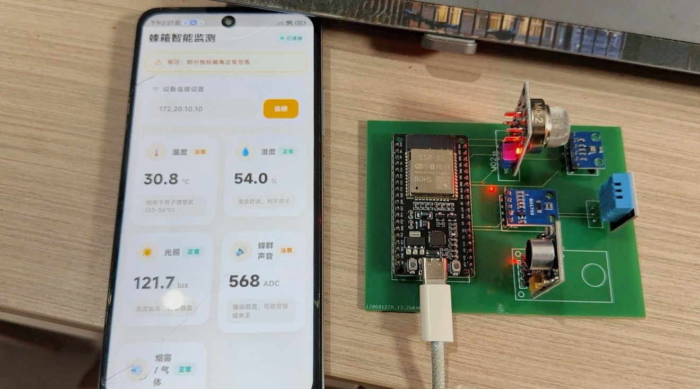

# 基于ESP32的蜂箱多传感器数据采集与局域网展示原型

> 本科阶段的软硬件教学原型。ESP32 读取 DHT11、BH1750、BMP280、模拟声音幅度和 MQ-2 原始 ADC；使用者在本地配置 Wi-Fi 后，Flutter 客户端可在可信局域网请求一条本地 JSON 响应。

[](https://github.com/rongyishuaige7/esp32-beehive-monitor/actions/workflows/validate.yml)
[](LICENSE)

> [!CAUTION]
> 这是用于 ESP32、传感器采集、局域网 HTTP 与 Flutter 学习的教学原型，不是蜂群健康诊断、疾病识别、养蜂生产决策、气象预报、烟雾/燃气/火灾报警、环境安全、告警送达或无人值守系统。
## 项目资料

这里整理了项目照片、界面截图和相关资料；文件处理说明见 [MEDIA_EVIDENCE](docs/MEDIA_EVIDENCE.md)。



## 源码功能范围

```text
DHT11 / BH1750 / BMP280 / 模拟声音幅度 / MQ-2 原始 ADC
  → ESP32 中的固定采样与中性阈值标签
  → 可选：可信局域网中的本地 HTTP JSON
  → Flutter 客户端的本地数据展示
```

- 温湿度、光照与气压字段只表示程序在该次读取中得到的传感器数值；不构成蜂群适宜度、动物健康、箱盖状态或环境安全结论。
- 声音字段是 GPIO34 的 ADC 峰峰值；不保存音频，也不表示蜂群嗡鸣、攻击、失王、健康或异常行为。
- `mq2Raw` 是 GPIO35 的未经浓度校准 ADC 数值；不是烟雾、燃气、火灾、空气质量或安全检测。
- `reference`、`attention`、`high_threshold`、`unavailable` 只是源码固定比较规则或当前字段未提供标记；不表示正常、安全、危险、告警、诊断、天气、处置或优先级。
- 气压趋势是短窗口数值换算演示；它不是天气预报、风暴判断或养蜂生产决策依据。

## 硬件与电气说明

| 模块/信号 | ESP32 接口 | 源码可确认事实 | 实物仍需确认 |
| :-- | :-- | :-- | :-- |
| DHT11 | GPIO4 | 使用 DHT 库读取温湿度 | 型号、供电、数据上拉、线长与读数 |
| BH1750 | GPIO21 / GPIO22 | I²C 光照读取 | 地址、上拉、电压、总线质量与读数 |
| BMP280 | GPIO21 / GPIO22，源码地址 `0x76` | I²C 气压读取 | 实物地址、模块版本、电压、安装位置与读数 |
| 模拟声音输入 | GPIO34 | ADC 峰峰值采样 | 模块型号、输出摆幅、偏置、电平调理与标定 |
| MQ-2 或兼容模块 | GPIO35 | 原始 ADC 平均值采样 | 型号、预热、供电、输出范围、电平调理与实物行为 |
| 状态 LED | GPIO2 | 固件以该 GPIO 指示 Wi-Fi 连接尝试结果 | 是否板载、极性、限流、电流与接法 |

[BOM](hardware/BOM.csv)、[接线图](hardware/wiring-diagram.svg)和[硬件说明](HARDWARE.md)列出了接口与元件。接线前务必断电，确认电压、电流、电平、限流、供电能力、公共地与 I²C 上拉；ESP32 GPIO/ADC 不得超过 3.3 V，MQ-2、LM386 或其他 AO 输出接入 GPIO34/GPIO35 前须完成分压或电平调理。

## 本地构建与 Wi-Fi 配置

### 1. 固件构建

```bash
git clone https://github.com/rongyishuaige7/esp32-beehive-monitor.git
cd esp32-beehive-monitor/firmware
python3 -m pip install 'platformio==6.1.19'
pio run -e esp32dev
```

### 2. 可选：本地 Wi-Fi 凭据

```bash
cd firmware/src
cp wifi_credentials.example.h wifi_credentials.h
# 仅在本机编辑 wifi_credentials.h，填写自己的 2.4 GHz Wi-Fi 配置
```

`wifi_credentials.h` 被 Git 忽略。不要提交、截图、录屏、粘贴到 Issue 或写入日志。未创建该文件时，固件仍能构建和采样，但不会连接 Wi-Fi 或启动 HTTP 服务。固件不会打印 SSID；如串口输出局域网 IP，请不要将其公开。

### 3. Flutter 客户端

```bash
cd app
flutter pub get
flutter test
flutter analyze
flutter build apk --debug
```

客户端只接受 RFC1918 / link-local IPv4，仅请求固定的明文 HTTP `/api/status`，并拒绝重定向；网络配置见[本地 HTTP API](#本地-http-api可选)。

### 4. 一键公开门禁

```bash
bash scripts/verify.sh
```

## 本地 HTTP API（可选）

仅当使用者提供本地 `wifi_credentials.h` 且 ESP32 成功加入网络时，固件才会在端口 `80` 启动无认证、无 TLS、无访问控制、无审计、无设备身份与无速率限制的本地 HTTP 接口。

它只能用于隔离、可信、短期的教学局域网，不能暴露到公网、端口转发、公共 Wi-Fi、共享热点或不可信局域网。项目未提供公网部署方案。

| 方法 | 路径 | 用途 |
| :-- | :-- | :-- |
| `GET` | `/api/status` | 返回原始字段、固定标签与初始化标志。 |
| 其他 | 任意路径 | 返回 `404` JSON；`OPTIONS /api/status` 返回 `405`。 |

字段与示例见[协议说明](docs/PROTOCOL.md)。

## 开源许可与第三方组件

Rongyi 自有的候选源码、文档、BOM 和接线边界图以 [MIT License](LICENSE) 发布。ESP32 Arduino 框架、PlatformIO、Flutter SDK、DHT、BH1750、BMP280、ArduinoJson、`http` 和 `shared_preferences` 均由使用者在构建时从上游获取；其来源与许可证入口见[第三方声明](THIRD_PARTY_NOTICES.md)。

## 安全提示

完整限制见[安全说明](SECURITY.md)。报告问题时，请勿公开 Wi-Fi 凭据、私网 IP/MAC、位置、网络日志、截图 EXIF/GPS、真实传感器记录、蜂场信息、个人信息或其他敏感材料。
